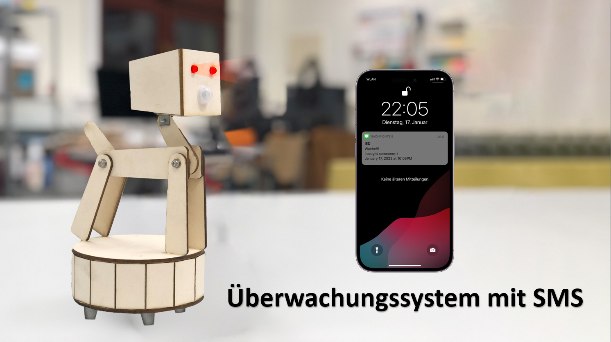
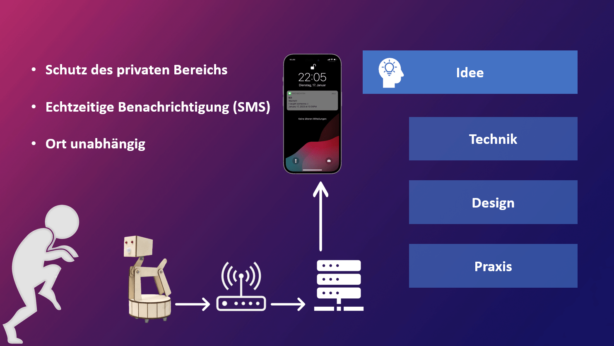
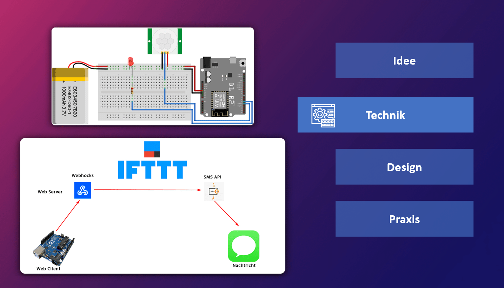
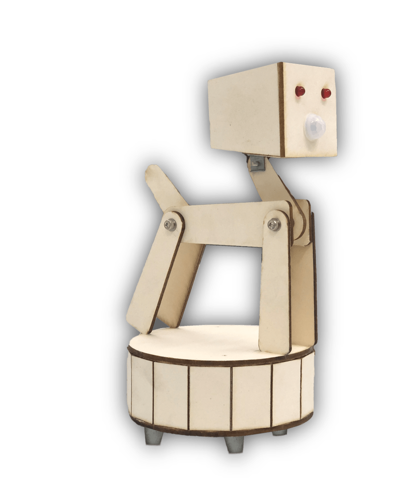

# Surveillance System via SMS

## Idee
- Schutz des privaten Bereichs
- Echtzeitige Benachrichtigung (SMS)
- Ort unabhängig 

## Technik
- erforderlich
  - Arduino (mit WiFi)
  - Bewegungssensor
  - LED
  - HW-Batterie 9V
  
- Programmirung
  - Source code => [hier](surveillance.system/source)
  - IFTTT Acount und Trigger privte key
  

## Design
- Design mit AutoCad (CAD)
- Material: dicke Papier und Schrauben
- Fertigstellung: Lasergerät
- Oberer Teil: Sensor, Licht und Dekorform
- Unterer Teil: Elektronik (Arduino)

